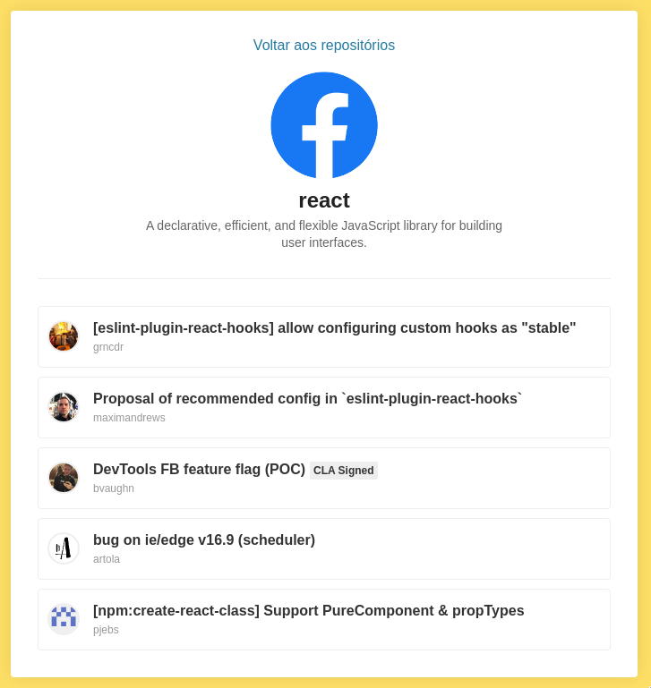

# Github List

Github List is a React SPA for you to store some of your favorite repostories in Github and see some information about it.

## Images

## Installation & Usage

Use [nodejs@10*]() or higher.

1. Clone this repostory. `git clone `
2. Go to the folder. `cd Github-List/`
3. Install the dependencies. `yarn` or `npm i`
4. Have fun!

## Contributing
Pull requests are welcome. For major changes, please open an issue first to discuss what you would like to change.

Please make sure to update tests as appropriate.

## License
[MIT](https://choosealicense.com/licenses/mit/)
